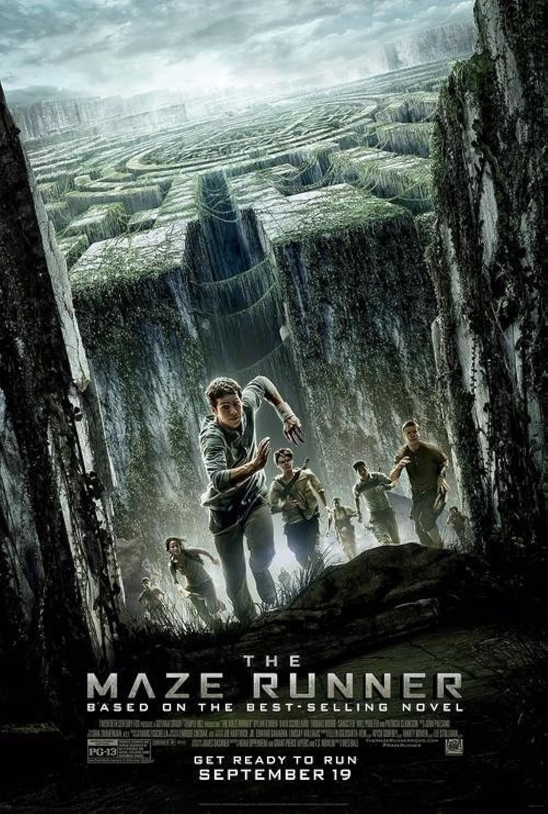

# **The Maze Runner**

### *The Maze Runner* is a renowned dystopian sci-fi film series based on James Dashner's books.
### *The series follows a group of teenagers who wake up in a mysterious maze with no memory of their past lives. They must work together to escape the maze and uncover the secrets behind their predicament.*

## **Overview of the Film**

-----------------------------------------------------------------------------------------------------------------------------

Thomas (Dylan O'Brien), a teenager, arrives in a glade at the center of a giant labyrinth. Like the other youths dumped there before him, he has no memory of his previous life. Thomas quickly becomes part of the group and soon after demonstrates a unique perspective that scores him a promotion to Runner status -- those who patrol the always-changing maze to find an escape route. Together with Teresa (Kaya Scodelario), the only female, Thomas tries to convince his cohorts that he knows a way
out.

-----------------------------------------------------------------------------------------------------------------------------

## **PLOT** 

-----------------------------------------------------------------------------------------------------------------------------

In the first film, Thomas is trapped in a bizarre maze among other youths who have lost their memory. As he joins the other guys, he discovers signs that indicate their maze is part of an experiment, and they must find a way out. The subsequent films, *The Scorch Trials* and *The Death Cure*, dig deeper into the secret underlying the maze and explore the outside world as they fight a worldwide crisis.

-----------------------------------------------------------------------------------------------------------------------------

# **Particulars**

## **Cast** 
- ### Dylan O'Brien AS Thomas
- ### Ki Hong Lee AS Minho
- ### Thomas Brodie-Sangster AS Newt
- ### Kays Scodelario AS Teresa
- ### Wll Poulter AS Gally
- ### Dexter Darden AS Frypan
- ### Blake Cooper AS Chuck
- ### Patricia Clarkson AS Ava Paige
- ### Aml Ameen AS Alby
- ### Chris Sheffield AS Ben

## **Release Date**: 
- ### *The Maze Runner* (2014)
- ### *Maze Runner: The Scorch Trials* (2015)
- ### *Maze Runner: The Death Cure* (2018)

## **Director**: Wes Ball
## **Based on**: The *Maze Runner* book series by James Dashner

# **Preferences**
- ## Favorite quotes
1. > "WICKED is good." - Thomas
2. > "If you ain't scared... You ain't human." - Alby

## What I Enjoy About It
- **Exciting Action**: The fast-paced chase scenes and high-stakes survival moments constantly keep you at the edge of your seat. The maze constantly shifts, and the looming threat of *The Grievers* adds to the suspense in every moment.

  > "The rush of trying to escape the maze pales in comparison to what awaits us outside."  
  > — Thomas, *The Maze Runner*

- **Engaging Plot**: The mystery surrounding the maze and the true purpose of the experiment keeps viewers intrigued. Each new revelation about the shadowy organization, *WICKED*, uncovers even more about their hidden agenda.

  > "I'm not sure who we can trust, but we have to escape together."  
  > — Teresa, *The Maze Runner*

- **Character Growth**: The relationships between the characters evolve throughout the series, especially Thomas' journey from an uncertain outsider to a determined leader. His growth and commitment to protect his friends is truly remarkable.

  > "You don’t get it, I have to do this. It's the only chance we have to save everyone."  
  > — Thomas, *Maze Runner: The Death Cure*
